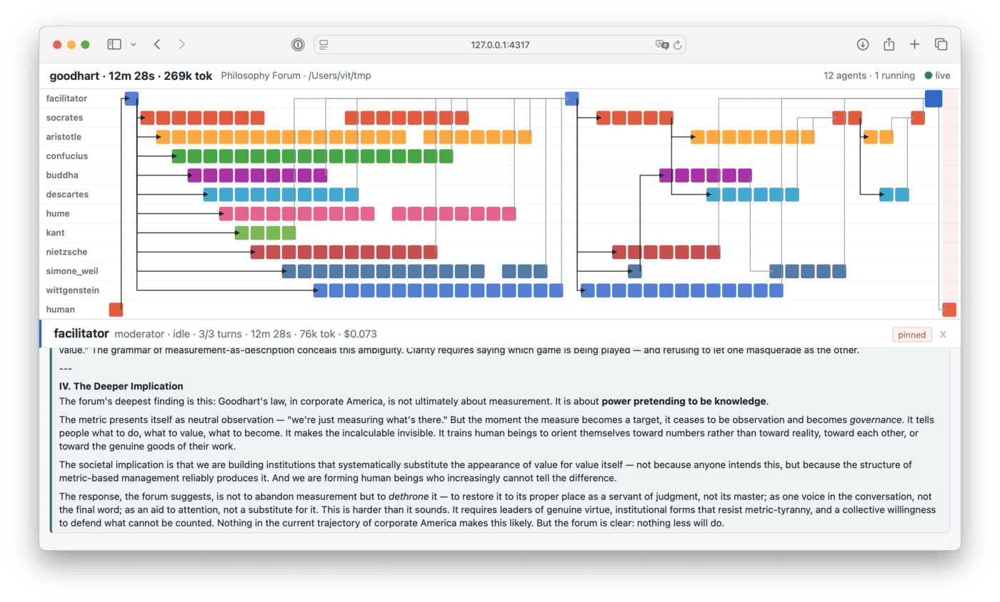

# mao - Minimal Agent Orchestration

`mao` is a local CLI for running a persistent team of coding agents against a repository. Agents communicate through framework-managed mail, and `mao` schedules them until the workflow finishes, blocks on another agent, or asks the human for input.

The project is experimental, unstable, and mostly built for my own education. It is vibe-coded and intentionally small. The interesting part is the orchestration model: agents have durable sessions, mail creates blocking waits, and those waits implicitly form a dynamic dependency graph.



The implementation has an intentionally strong dependency on [`@mariozechner/pi-coding-agent`](https://github.com/badlogic/pi-mono).

## Quick Start

```sh
# Install pi if you don't already have it
npm install -g @mariozechner/pi-coding-agent

# Run pi once and use /login to connect a model (OAuth or API key)
pi

# Clone mao, build it, and link it globally
npm install
npm run build
npm link

cd /path/to/a/repo
mao run --project demo --repo . --workflow star-team --prompt "create a hello world CLI"
```

Mao uses pi's default model unless a workflow overrides it per-agent (e.g., [stavros](workflows/stavros/config.json) assigns specific models to each role).

Resume later from the repo directory:

```sh
mao run --project demo
mao status --project demo
```

## Concepts

- **Agent** — a persona backed by one persistent pi session JSONL file.
- **Turn** — one `session.prompt()` call. The framework injects the agent's unread inbox at the start of the turn.
- **Mail** — `sendMail(to, content)` sends blocking mail. The sender waits until the recipient calls `reply(content)`.
- **Wait graph** — open mail implicitly forms a dynamic graph: `sender -> recipient`. Replies close edges.
- **Scheduler** — runs ready agents oldest-ready-first. When an agent has multiple outstanding mails, it wakes only after all replies arrive.
- **Human** — built-in agent backed by stdin. `sendMail(human, question)` blocks until the person running `mao` replies.

This is loosely in the spirit of communicating sequential processes: agents do not write to each other directly; they communicate by sending messages, and the scheduler coordinates blocking and wakeup.

## Agent Tools

Agents receive the framework tools during their pi session turn:

| Tool | Description |
|------|-------------|
| `sendMail(to, content)` | Send blocking mail to another agent. Call it multiple times in one turn for fan-out, then call `yield()`. |
| `reply(content)` | Answer the active mail and unblock its sender. Plain assistant text does not close mail. |
| `yield()` | End the turn after sending mail, or when there is no active mail to answer. |

Plus whichever standard pi coding tools the workflow grants to that persona, commonly `read`, `bash`, `edit`, and `write`.

## CLI

```sh
mao run [--project name] [--repo path] [--workflow id] [--model spec] [--parallel n] [--prompt text]
mao status [--project name] [--verbose] [--json]
mao ui     [--project name] [--host 127.0.0.1] [--port 4317]
mao reset  [--project name] [--confirm]
mao list
```

Project name is inferred when the current directory is inside a known project's repo. Pass `--project` to be explicit.

`--model` accepts pi's `provider/model:thinking` syntax as a run-wide model override. `--parallel` limits concurrent ready agents; the default is 8, and `--parallel 1` is useful for deterministic local testing.

`mao status` shows a compact operational snapshot. Use `--verbose` for detailed counts and wait relationships, or `--json` to print the shared status snapshot used by observability integrations.

`mao ui` starts a read-only, single-project observability UI at `/`. `GET /api/status` returns the same shared status snapshot as `mao status --json`; `GET /api/health` reports API health.

## State

Project state lives under `.mao/<project-name>/` in the current directory or
one of its parents when present. Otherwise, MAO falls back to
`~/.mao/<project-name>/`:

```text
.mao/<project-name>/
  config.json          # repo path + workflow id
  state.db             # SQLite: agents, mail, turns
  sessions/
    <agent-id>.jsonl   # pi session file per agent
```

State persists across interruptions. `mao run` resumes from the stored scheduler state and pi sessions.

## Workflows

Workflows are reusable orchestration recipes. A workflow defines the persona roster, the lead agent, optional per-persona model settings, enabled tools, and how the first human request is collected.

The same repo can be run with different workflows. For example, one workflow can be a batch-style virtual team, while another can require architect approval before implementation.

Workflow ids resolve to built-in workflow directories:

```text
workflows/
  star-team/
    config.json
    personas.json
    don.md
    ...
```

`config.json` defines workflow metadata:

```json
{
  "id": "star-team",
  "name": "All-Star Team",
  "description": "Batch-mode virtual software team inspired by https://tarantsov.com/all-star-zoo/",
  "personas_manifest": "personas.json",
  "lead": "don",
  "shared_prompt": "common.md",
  "start": {
    "to": "don",
    "ask": "What would you like the team to work on?",
    "instruction": "You are the technical lead. A new task has arrived."
  },
  "agent_overrides": {
    "don": { "model": "claude-opus-4-6", "thinking_level": "medium" }
  }
}
```

Persona files are Markdown system prompts. `personas.json` maps persona ids to prompt files and enabled tools. The `human` agent is always available and does not need a persona file.

## Built-In Workflows

`star-team` is inspired by [My all-star zoo](https://tarantsov.com/all-star-zoo/) by Andrey Tarantsov. It runs a batch-mode virtual team with specialized planning, implementation, testing, review, and learning roles.

`stavros` is inspired by [How I write software with LLMs](https://www.stavros.io/posts/how-i-write-software-with-llms/) by Stavros Korokithakis. An Architect clarifies with the human until the plan is approved, sends implementation to a Developer, then asks independent reviewers to critique the result before adjudicating feedback.

`philosophy-forum` is a moderated discussion workflow with philosopher personas. The human gives a topic to a facilitator, who invites the cast to discuss it, encourages direct side exchanges when useful, and eventually synthesizes the disagreements and insights. It is loosely inspired by Daily Nous's [Philosophers On GPT-3](https://dailynous.com/2020/07/30/philosophers-gpt-3/) post, but it is just a playful orchestration recipe, not a careful or scientific reproduction of that experiment.

## Architecture

Each agent has one persistent pi session. Each scheduler turn injects an inbox digest into that session, lets the model act, records any framework tool calls, then marks the injected mail delivered after a successful turn.

Agent state follows this loop:

```text
idle     -> receives mail        -> ready
ready    -> scheduler starts turn -> running
running  -> sends mail           -> waiting
running  -> replies or yields    -> idle
waiting  -> all replies received -> ready
```

`mao` owns orchestration state, mail delivery, scheduling, workflow loading, and the derived wait graph. Pi owns model/provider configuration, session history, compaction, and the standard coding tools.

## Development

```sh
npm install
npm run typecheck
npm run build
npm run dev -- status --project demo
```

The CLI entry point is [src/cli.ts](src/cli.ts). Core runtime pieces are:

- [src/scheduler.ts](src/scheduler.ts) — scheduler loop and turn execution
- [src/db.ts](src/db.ts) — SQLite persistence
- [src/runner.ts](src/runner.ts) — pi session creation and turn prompting
- [src/tools.ts](src/tools.ts) — framework tools exposed to agents
